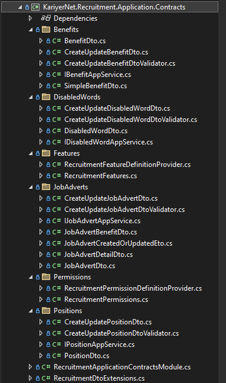

# KariyerNet.Recruitment

## Kullanılan Teknolojiler

* .NET 8
* PostgreSQL
* RabbitMQ
* Fluent Validation
* ABP Framework

## Kurulum

[docker-compose.yml](./ProjectFiles/docker-compose.yml) dosyasını çalıştırın. 

```bash
docker compose up -d
```

Aşağıda belirtilen projelerdeki appsettings.json connection string ifadelerini güncelleyin. 

* `KariyerNet.Recruitment.DbMigrator`: [appsettings.json](./src/KariyerNet.Recruitment.DbMigrator/appsettings.json)
* `KariyerNet.Recruitment.AuthServer`: [appsettings.json](./src/KariyerNet.Recruitment.AuthServer/appsettings.json)
* `KariyerNet.Recruitment.HttpApi.Host`: [appsettings.json](./src/KariyerNet.Recruitment.HttpApi.Host/appsettings.json)

İlk kurulum için **KariyerNet.Recruitment.DbMigrator** projesini çalıştırın. Bu sayede migration işlemleri belirtilen connection string'e veritabanına yapılacaktır.


Uygulamaları ayağa kaldırmak için `KariyerNet.Recruitment.AuthServer` ve `KariyerNet.Recruitment.HttpApi.Host` uygulamalarını çalıştırın.

`KariyerNet.Recruitment.AuthServer` Uygulaması ekran görüntüsü


`KariyerNet.Recruitment.HttpApi.Host` Uygulaması ekran görüntüsü


### Tablolar arasındaki ilişki


### Projede kodların çoğunlukla yazıldığı kısımlar

`KariyerNet.Recruitment.Domain`: Uygulamanın domain modülü. Bu modülde entityler, domain servisler, seed datalar yer almaktadır.


`KariyerNet.Recruitment.Domain.Shared`: Uygulamanın domain shared modülü. Bu modülde entityde kullanılan enumlar, const değerleri vb. bulunmaktadır.


`KariyerNet.Recruitment.EntityFrameworkCore`: Uygulamanın ef core modülü. Bu modülde DbContext ve buna bağlı ayarlar bulunmaktadır.


`KariyerNet.Recruitment.Application`: Uygulamanın application modülü. Bu modülde uygulamanın servisleri yer almaktadır. 


`KariyerNet.Recruitment.Application.Contracts`: Uygulamanın application contracts modülü. Bu modülde çoğunlukla dto, eto sınıfları yer almaktadır.



### Rabbit MQ Örneği

* Uygulamada bir ilan oluşturulduğunda ya da güncellendiğinde otomatik olarak bir event fırlatılıyor. Bu eventi RabbitMQ kullanarak ilgili queue'ya yönlendiriyoruz. Bu queue'yu dinleyen consumer aşağıda belirtilen handler ile yakalanıp işleniyor.
 
[JobAdvertCreatedOrUpdatedEventHandler.cs](./src/KariyerNet.Recruitment.Application/JobAdverts/JobAdvertCreatedOrUpdatedEventHandler.cs) 

### Postman Collection
[Recruitment API Postman Collection](./ProjectFiles/RecruitmentAPI.postman_collection.json)

### Uygulama Yapısı ve Örnek Kullanım

Uygulama SaaS yapıda. Host ile ilan, yan haklar, pozisyonlar, yasaklı kelimeler endpointleri kullanılamayacak yapıda tasarlandı. (Permissionlar ile. İlgili permissionlar sadece tenant için kullanılabiliyor.) Bu yüzden de ilgili endpointleri kullanabilmek için tenant kullanıcına ihtiyacımız var. Tenant kullanıcısı için de tenant'a ihtiyacımız var. 

Bu yüzden ilk olarak host kullanıcısı ile login olup daha sonra tenant oluşturmalıyız.


Sonrasında tenant oluşturuyoruz. Token setlememize gerek yok. Otomatik olarak Bearer token setlenecektir.


Tenant oluşturulduğu için ilgili tenant'a geçip endpointleri test edebiliriz. Bunun için tekrar login olmamız gerekiyor. 

İlk olarak cookieleri temizlemeliyiz. (Aksi halde yanlış tenant bilgisini cookieden çekip ona login olmaya çalışabilir.)


Daha sonrasında `__tenant` key değeri olarak tenant bilgisini yani `test_firma` değerini geçmemiz gerekli. 


Tenant oluştururken tenant'a ait olan kullanıcı bilgilerinin girildiğinden emin olun.


* `NOT:` Örnek tenant admin kullanıcısı üzerinden ilerlemiştir. Yeni bir kullanıcı oluşturup ilgili permissionlar setlendikten sonra oluşturulan kullanıcı için de testler yapılabilir. Fakat bu daha uzun bir işlem olduğundan dolayı tenant admin üzerinden ilerlemek daha uygun.

Artık endpointlere istek atıp testleri gerçekleştirebiliriz. Örneğin pozisyonlar için ekran şu şekilde olacaktır. (Her tenant oluşumunda seed data tetiklendiği için bir kaç pozisyon test kullanım için hazır gelmekte.)


Örneğin ilanlara istek atarsak kayıt sayısını 0 görürürüz.


İlan ekleyelim.


2 den fazla eklediğimizde aşağıdaki gibi hata alırız. (Her kullanıcı için maks 2 adet ilan oluşturulabilir.)


Listeleme yaptığımızda bu kullanıcıya ait olan ilanları görürüz.


İlan ile ilgili detaylı bilgiye erişmek için aşağıdaki gibi istek atabilirsiniz. (İlana ait olan pozisyon ad ve tanım bilgisini içerir.)
Ek olarak quality değerinin de 5 olduğuna dikkat edelim. RabbitMQ yapısı doğru çalışıp değeri 5 olarak setlemiş.


### Proje ile ilgili diğer bilgiler
* PostreSQL bilgileri
  * `Host`: localhost => docker için db
  * `Port`: 5432
  * `Database`: Recruitment
  * `User ID`: admin
  * `Password`: 1q2w3E* 
* pgAdmin4 UI'ına erişmek için; `http://localhost:16543/` adresi kullanılabilir.
  * `Username`: admin@admin.com
  * `Password`: 1q2w3E*
 


* RabbitMQ UI'ına erişmek için; `http://localhost:15672/` adresi kullanılabilir.
  * `Username`: guest
  * `Password`: guest

Exchange olarak `KariyerNetRecruitmentAppExchange` kullanıyoruz. Bu exchange'e bağlı olan routing keyler aşağıdadır. Oluşturduğumuz event için `JobAdvert.CreatedOrUpdated` routing key kullanılıyor. Diğerleri abp framework'ün kendi içerisinde kullandığı routing keylerdir.


### ABP framework ile gelen README aşağıdadır. 

## About this solution

This is a layered startup solution based on [Domain Driven Design (DDD)](https://docs.abp.io/en/abp/latest/Domain-Driven-Design) practises. All the fundamental ABP modules are already installed. 

### Pre-requirements

* [.NET 8.0+ SDK](https://dotnet.microsoft.com/download/dotnet)
* [Node v18 or 20](https://nodejs.org/en)
* [Redis](https://redis.io/)

### Configurations

The solution comes with a default configuration that works out of the box. However, you may consider to change the following configuration before running your solution:

* Check the `ConnectionStrings` in `appsettings.json` files under the `KariyerNet.Recruitment.AuthServer`, `KariyerNet.Recruitment.HttpApi.Host` and `KariyerNet.Recruitment.DbMigrator` projects and change it if you need.

### Before running the application

#### Generating a Signing Certificate

In the production environment, you need to use a production signing certificate. ABP Framework sets up signing and encryption certificates in your application and expects an `openiddict.pfx` file in your application.

This certificate is already generated by ABP CLI, so most of the time you don't need to generate it yourself. However, if you need to generate a certificate, you can use the following command:

```bash
dotnet dev-certs https -v -ep openiddict.pfx -p 7cd40a94-ec32-4415-b985-2bc2c4dc9538
```

> `7cd40a94-ec32-4415-b985-2bc2c4dc9538` is the password of the certificate, you can change it to any password you want.

It is recommended to use **two** RSA certificates, distinct from the certificate(s) used for HTTPS: one for encryption, one for signing.

For more information, please refer to: https://documentation.openiddict.com/configuration/encryption-and-signing-credentials.html#registering-a-certificate-recommended-for-production-ready-scenarios

> Also, see the [Configuring OpenIddict](https://docs.abp.io/en/abp/latest/Deployment/Configuring-OpenIddict#production-environment) documentation for more information.

#### Install Client-Side Libraries

Run the following command in the directory of your final application:

```bash
abp install-libs
```

> This command installs all NPM packages for MVC/Razor Pages and Blazor Server UIs and this command is already run by the ABP CLI, so most of the time you don't need to run this command manually.

#### Create the Database

Run `KariyerNet.Recruitment.DbMigrator` to create the initial database. This should be done in the first run. It is also needed if a new database migration is added to the solution later.

### Solution structure

This is a layered monolith application that consists of the following applications:

* `KariyerNet.Recruitment.DbMigrator`: A console application which applies the migrations and also seeds the initial data. It is useful on development as well as on production environment.
* `KariyerNet.Recruitment.AuthServer`: ASP.NET Core MVC / Razor Pages application that is integrated OAuth 2.0(`OpenIddict`) and account modules. It is used to authenticate users and issue tokens.
* `KariyerNet.Recruitment.HttpApi.Host`: ASP.NET Core API application that is used to expose the APIs to the clients.
* `KariyerNet.Recruitment.Blazor`: ASP.NET Core Blazor WASM application that is a single page application that runs on the browser.

### Deploying the application

Deploying an ABP application is not different than deploying any .NET or ASP.NET Core application. However, there are some topics that you should care about when you are deploying your applications. You can check ABP's [Deployment documentation](https://docs.abp.io/en/abp/latest/Deployment/Index) before deploying your application.

### Additional resources

You can see the following resources to learn more about your solution and the ABP Framework:

* [Web Application Development Tutorial](https://docs.abp.io/en/abp/latest/Tutorials/Part-1)
* [Application Startup Template Structure](https://docs.abp.io/en/abp/latest/Startup-Templates/Application)
